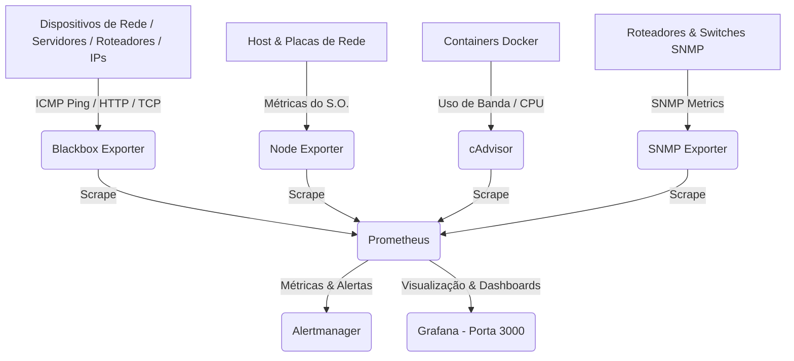

# 🌐 Stack Docker para Monitoramento de Infraestrutura de Redes

Ambiente completo em Docker Compose para **coleta de métricas, monitoramento de latência/disponibilidade e visualização em tempo real de infraestruturas de rede**.

---

## 🛠️ Arquitetura do Sistema



---

## 📋 Componentes e Serviços

| Serviço | Função na Infraestrutura | Porta Padrão |
| :--- | :--- | :---: |
| 📊 **Grafana** | Dashboards interativos e visualização em tempo real | `3000` |
| ⚡ **Prometheus** | Coleta, armazenamento de séries temporais e avaliação de regras | `9090` |
| 🌐 **Blackbox Exporter** | Testes de conectividade de rede (ICMP Ping RTT, HTTP/HTTPS, TCP) | `9115` |
| 💻 **Node Exporter** | Métricas de rede física do servidor host, tráfego RX/TX e interfaces | `9100` |
| 📡 **SNMP Exporter** | Leitura de métricas SNMP de switches, roteadores e firewalls | `916` |
| 🚨 **Alertmanager** | Gerenciamento e disparo de alertas de parada de rede e alta latência | `9093` |
| 🐳 **cAdvisor** | Monitoramento do consumo de rede e recursos dos containers Docker | `8080` |

---

## ⚡ Início Rápido

```bash
# 1. Entre no repositório
cd monitoramento-redes-docker

# 2. Sobe a infraestrutura completa
./monitor up

# 3. Acesse o Grafana no seu navegador:
# http://localhost:3000
# Usuário: admin
# Senha: admin
```

---

## 🖥️ Dashboards Pré-Configurados

A aplicação já vem com o painel **"Painel de Infraestrutura de Redes — Overview"** provisionado automaticamente no Grafana, contendo:

1. **Status de Disponibilidade dos Alvos (Ping ICMP & HTTP)**: Indicador visual em tempo real do estado de cada host monitorado (🟢 UP / 🔴 DOWN).
2. **Latência de Rede (RTT - Round Trip Time)**: Gráfico temporal comparando o tempo de resposta em milissegundos de provedores, gateways e servidores.
3. **Tráfego de Banda de Rede do Host (RX/TX)**: Taxa de download e upload em Bytes/s separada por interface de rede.

---

## 🎯 Como Adicionar Novos Alvos de Rede para Monitorar

Você pode adicionar novos roteadores, switches, servidores ou endereços IP para monitorar de duas formas:

### 1. Via linha de comando (Recomendado)
```bash
./monitor add-target 192.168.1.1 ping      # Adiciona teste de Ping ICMP
./monitor add-target https://meusite.com http # Adiciona teste HTTP/HTTPS
```

### 2. Manualmente via arquivo
Edite o arquivo `prometheus/prometheus.yml` na seção `targets` e execute:
```bash
./monitor reload
```

---

## 🛠️ Comandos do CLI `./monitor`

```bash
./monitor up                # Sobe todos os containers de monitoramento
./monitor down              # Para e remove os containers
./monitor status            # Exibe o status da stack
./monitor logs [serviço]    # Visualiza os logs em tempo real
./monitor targets           # Lista os alvos configurados no Prometheus
./monitor reload            # Recarrega configurações do Prometheus
```

---

<div align="center">
  <sub>Desenvolvido com excelência por <b>Matheus Vitor Lourenço Schionato</b></sub>
</div>
