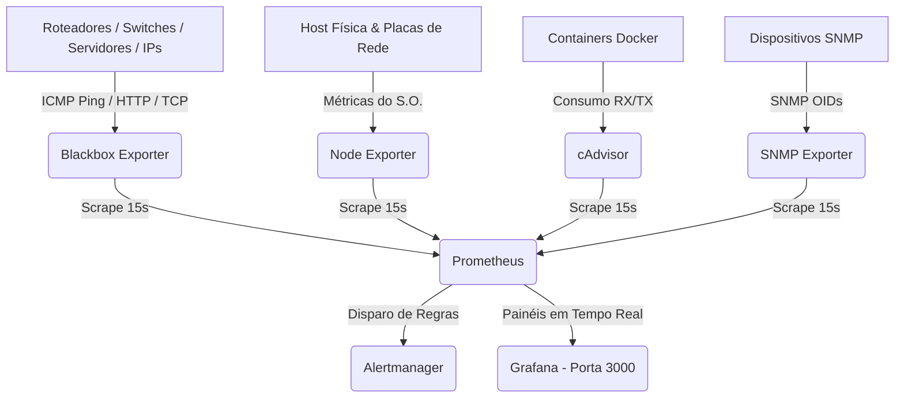

<div align="center">

  <!-- ANIMATED TYPING HEADER -->
  <a href="https://github.com/MvitorLS/monitoramento-redes-docker">
    
  </a>

  <p align="center">
    <b>Stack em Docker Compose para métricas de latência, disponibilidade de hosts e análise de tráfego de rede em tempo real.</b>
  </p>

  <p align="center">
    
    
    
  </p>

</div>


---

## 🛠️ Arquitetura da Infraestrutura de Rede



---

## 📋 Componentes da Stack

<div align="center">

| Serviço | Função Principal na Rede | Porta | Access URL |
| :--- | :--- | :---: | :---: |
| 📊 **Grafana** | Dashboards interativos e mapas visuais | `3000` | `http://localhost:3000` |
| ⚡ **Prometheus** | Coleta de séries temporais e motor de busca PromQL | `9090` | `http://localhost:9090` |
| 🌐 **Blackbox Exporter** | Testes de latência ICMP Ping, HTTP Status e portas TCP | `9115` | `http://localhost:9115` |
| 💻 **Node Exporter** | Métricas de hardware e tráfego de interface (RX/TX Bytes/s) | `9100` | `http://localhost:9100` |
| 📡 **SNMP Exporter** | Leitura de métricas SNMP de ativos de rede | `9116` | `http://localhost:9116` |
| 🚨 **Alertmanager** | Gerenciador e roteador de alertas de indisponibilidade | `9093` | `http://localhost:9093` |
| 🐳 **cAdvisor** | Análise de tráfego e recursos dos containers Docker | `8080` | `http://localhost:8080` |

</div>

---

## ⚡ Início Rápido

```bash
# 1. Clone o repositório
git clone https://github.com/MvitorLS/monitoramento-redes-docker.git
cd monitoramento-redes-docker

# 2. Sobe toda a stack de monitoramento
./monitor up

# 3. Acesse o Grafana no navegador:
# http://localhost:3000 (Credenciais: admin / admin)
```

---

## 🎯 Adicionando Novos Alvos de Rede (IPs, Routers, Servidores)

Com a CLI `./monitor` você adiciona novos hosts diretamente no terminal:

```bash
# Adicionar teste de Ping ICMP em um Roteador/IP
./monitor add-target 192.168.1.1 ping

# Adicionar monitoramento HTTP em um Servidor/Site
./monitor add-target https://meusite.com http

# Recarregar as configurações do Prometheus
./monitor reload
```

---


<div align="center">
  <sub>Projetado e desenvolvido por <b>Matheus Vitor Lourenço Schionato</b></sub>
</div>
