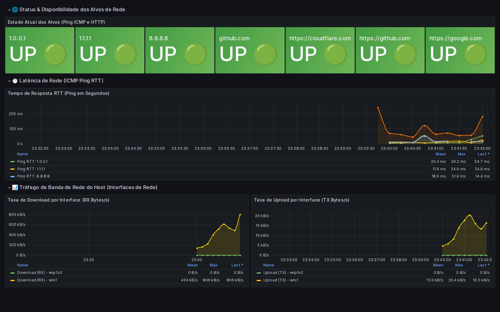
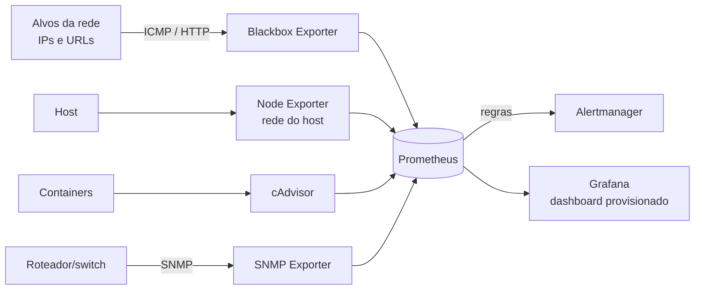

# Monitoramento de Redes com Docker

Stack de observabilidade para uma rede pequena (casa, laboratório, escritório) que sobe com um comando: mede se os hosts respondem a ping/HTTP, a latência, o tráfego das interfaces do host e o consumo dos containers, e dispara alerta quando algo cai.




```mermaid
flowchart LR
    T[Alvos da rede<br/>IPs e URLs] -- ICMP / HTTP --> BB[Blackbox Exporter]
    H[Host] --> NE[Node Exporter<br/>rede do host]
    R[Roteador/switch] -- SNMP --> SN[SNMP Exporter]
    C[Containers] --> CA[cAdvisor]
    BB & NE & CA & SN --> P[(Prometheus)]
    P -- regras --> AM[Alertmanager]
    P --> G[Grafana<br/>dashboard provisionado]
```

## O que vem configurado

| Serviço | Porta | Função |
| --- | --- | --- |
| Prometheus | 9090 | Coleta e armazena as métricas, avalia as regras de alerta |
| Blackbox Exporter | 9115 | Probes ICMP (ping) e HTTP nos alvos |
| Node Exporter | 9100 | CPU, memória, disco e tráfego das interfaces reais do host (roda com `network_mode: host`) |
| cAdvisor | 8080 | Uso de recursos por container |
| Alertmanager | 9093 | Recebe e agrupa os alertas |
| Grafana | 3000 | Dashboard "Infraestrutura de Redes — Overview" já provisionado |
| SNMP Exporter | 9116 | Tráfego por interface de roteador/switch (IF-MIB, SNMP v2c) |

**Alertas** (`prometheus/rules/network_alerts.yml`):
- `NetworkTargetDown` — alvo sem resposta por 1 min;
- `HighNetworkLatency` — ping acima de 100 ms por 2 min (só conta probes bem-sucedidos, para não duplicar o alerta de alvo fora do ar);
- `NodeExporterDown` — perdeu a coleta do host.

O datasource e o dashboard do Grafana são provisionados por arquivo (`grafana/provisioning/`), então o painel já aparece pronto no primeiro `up`.

## Rodando

```bash
./monitor up                              # sobe tudo
./monitor add-target 192.168.1.1 ping     # adicione o seu gateway (veja com: ip route)
./monitor add-target https://exemplo.com http
./monitor reload                          # recarrega o Prometheus sem derrubar
./monitor status | logs [serviço] | down
```

`add-target` edita o `prometheus.yml` com Python + PyYAML no host (`pip install pyyaml`).

Grafana em http://localhost:3000 (login inicial `admin` / `admin` — troque no primeiro acesso).

### Notificações no Telegram

O Alertmanager já tem um receiver `telegram` configurado:

1. salve o token do bot em `alertmanager/telegram_token` (fica fora do git);
2. troque `chat_id` em `alertmanager/alertmanager.yml` pelo seu;
3. mude `receiver: 'default-receiver'` para `receiver: 'telegram'` e rode `docker compose restart alertmanager`.

### SNMP

O job `snmp` aponta para `192.168.1.1` com a community padrão `public`. Troque pelo IP do seu roteador/switch em `prometheus/prometheus.yml` e habilite SNMP v2c nele; sem isso o alvo aparece como `down` em http://localhost:9090/targets.
