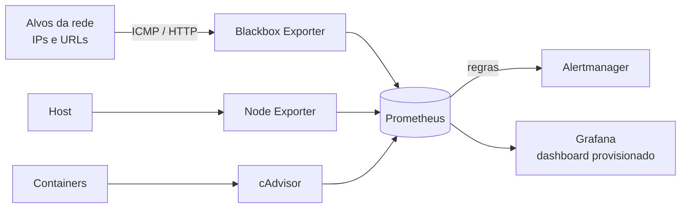

# Monitoramento de Redes com Docker

Stack de observabilidade para uma rede pequena (casa, laboratório, escritório) que sobe com um comando: mede se os hosts respondem a ping/HTTP, a latência, o tráfego das interfaces do host e o consumo dos containers, e dispara alerta quando algo cai.


```mermaid
flowchart LR
    T[Alvos da rede<br/>IPs e URLs] -- ICMP / HTTP --> BB[Blackbox Exporter]
    H[Host] --> NE[Node Exporter]
    C[Containers] --> CA[cAdvisor]
    BB & NE & CA --> P[(Prometheus)]
    P -- regras --> AM[Alertmanager]
    P --> G[Grafana<br/>dashboard provisionado]
```

## O que vem configurado

| Serviço | Porta | Função |
| --- | --- | --- |
| Prometheus | 9090 | Coleta e armazena as métricas, avalia as regras de alerta |
| Blackbox Exporter | 9115 | Probes ICMP (ping) e HTTP nos alvos |
| Node Exporter | 9100 | CPU, memória, disco e tráfego de rede do host |
| cAdvisor | 8080 | Uso de recursos por container |
| Alertmanager | 9093 | Recebe e agrupa os alertas |
| Grafana | 3000 | Dashboard "Infraestrutura de Redes — Overview" já provisionado |
| SNMP Exporter | 9116 | Sobe junto, mas ainda sem job de coleta (ver próximos passos) |

**Alertas** (`prometheus/rules/network_alerts.yml`):
- `NetworkTargetDown` — alvo sem resposta por 1 min;
- `HighNetworkLatency` — ping acima de 100 ms por 2 min;
- `NodeExporterDown` — perdeu a coleta do host.

O datasource e o dashboard do Grafana são provisionados por arquivo (`grafana/provisioning/`), então o painel já aparece pronto no primeiro `up`.

## Rodando

```bash
./monitor up                              # sobe tudo
./monitor add-target 192.168.1.1 ping     # adiciona um alvo de ping
./monitor add-target https://exemplo.com http
./monitor reload                          # recarrega o Prometheus sem derrubar
./monitor status | logs [serviço] | down
```

`add-target` edita o `prometheus.yml` com Python + PyYAML no host (`pip install pyyaml`).

Grafana em http://localhost:3000 (login inicial `admin` / `admin` — troque no primeiro acesso).

## Próximos passos

- [ ] Job de scrape do SNMP Exporter para roteador/switch
- [ ] Receiver real no Alertmanager (Telegram ou e-mail)
- [ ] Screenshot do dashboard neste README
